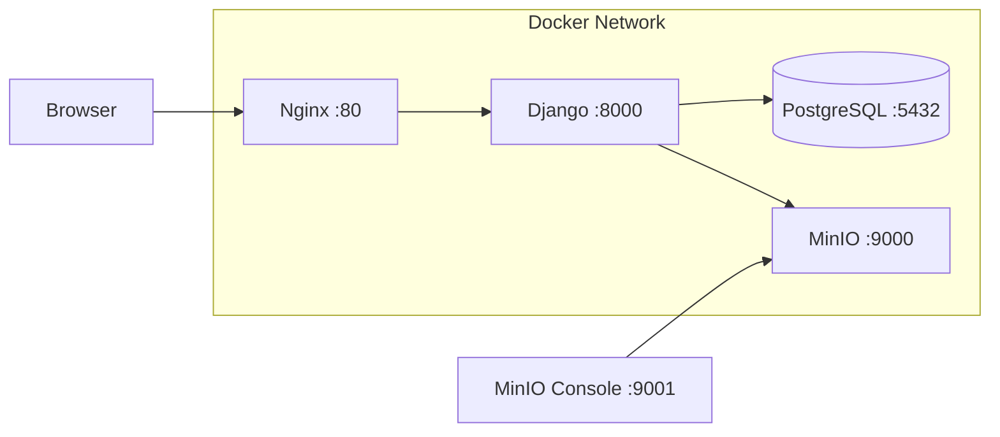
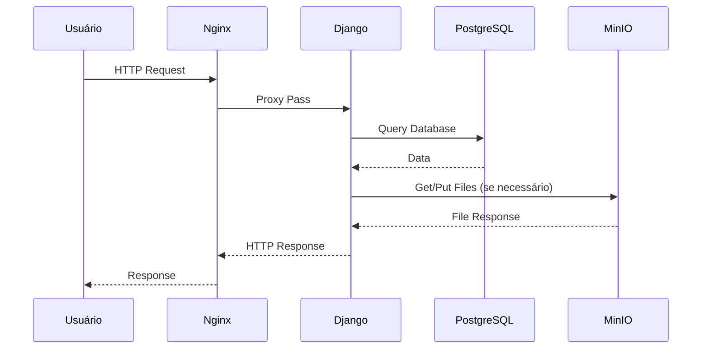

# Arquitetura do Sistema

O ChamaDevOps segue uma arquitetura **Monólito Modular** baseada no framework Django 6.0.

## Stack Tecnológica

| Componente | Tecnologia | Descrição |
|------------|------------|-----------|
| **Backend** | Python 3.12+ / Django 6.0 | Framework web principal |
| **Frontend** | Django Templates + TailwindCSS | Interface responsiva |
| **Banco de Dados** | PostgreSQL | Banco relacional (Docker) |
| **Armazenamento** | MinIO | Compatível S3 para arquivos |
| **Proxy Reverso** | Nginx | Load balancer e SSL |
| **Containerização** | Docker + Docker Compose | Ambiente padronizado |

## Infraestrutura Docker



## Estrutura de Diretórios

A organização do código segue a separação por domínios (`apps`) com o prefixo `app_`.

```text
chama-devops/
├── core/                   # Configurações do Projeto (settings, urls, wsgi)
├── app_accounts/           # Gestão de Identidade (User Model, Auth)
├── app_management/         # Domínio Administrativo (Projetos, Tópicos)
├── app_tickets/            # Domínio Operacional (Tickets, Comentários, Histórico)
├── app_reports/            # Dashboard e Métricas
├── templates/              # Templates HTML globais e por app
├── static/                 # Arquivos estáticos (CSS, JS, Imagens)
├── docs/                   # Documentação do projeto
├── docker-compose.yml      # Configuração dos containers
├── Dockerfile              # Build da imagem Django
├── Makefile                # Comandos automatizados
├── nginx.conf              # Configuração do Nginx
└── manage.py               # Utilitário de comando do Django
```

---

## Detalhes dos Módulos

### 1. `app_accounts`
Responsável pela autenticação e autorização.
*   Implementa um **Custom User Model** (`User`) que utiliza `email` como identificador principal (sem `username`).
*   Gerencia o login, logout e permissões básicas (`is_staff`).

### 2. `app_management`
Responsável pelas estruturas organizacionais.
*   **Project**: Grupos lógicos de tickets (ex: "Migração AWS", "Suporte Interno").
    - Possui gerente responsável e membros vinculados.
*   **Topic**: Categorias de tickets com suporte a templates.
    - Campo `template` para modelo de descrição.
    - Campo `form_fields` para campos dinâmicos em JSON.

### 3. `app_tickets`
O núcleo operacional do sistema.
*   **Ticket**: A solicitação em si. Conecta Users, Projects e Topics.
    - Suporte a **prioridade** (LOW, MEDIUM, HIGH, CRITICAL).
    - Métricas **SLA** (first_response_at, resolved_at).
*   **Comment**: Comunicação dentro do ticket. Suporta comentários internos (apenas staff).
*   **TicketAttachment**: Arquivos anexados aos tickets.
*   **TicketHistory**: Registro de mudanças para auditoria (status, assignee).

### 4. `app_reports`
Responsável pela inteligência de dados e visualização.
*   **Dashboard**: Visão gerencial com filtros por data, projeto e status.
*   **Métricas**: Contagem de tickets, evolução temporal e distribuição por responsável.
*   **SLA Analytics**: Tempo médio de resposta e resolução.

---

## Decisões de Design

*   **Responsividade**: Interface construída com TailwindCSS "mobile-first", garantindo acesso em celulares e desktops.
*   **Simplicidade**: Uso de templates server-side para evitar complexidade de SPA (Single Page Applications) desnecessária.
*   **Docker-First**: Ambiente containerizado para fácil deploy e escalabilidade.
*   **Armazenamento S3-Compatible**: MinIO permite migração futura para AWS S3 sem mudanças de código.
*   **Auditoria**: TicketHistory garante rastreabilidade de todas as mudanças.

---

## Fluxo de Requisição


