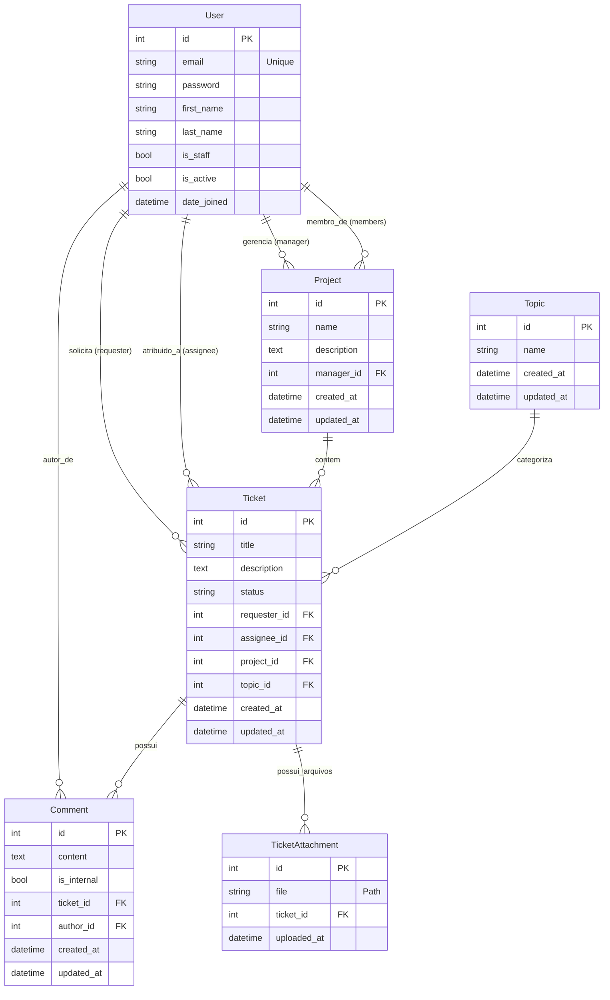

# Banco de Dados

Este documento descreve detalhadamente a estrutura de dados ("Schema") do sistema ChamaDevOps.

## Diagrama ER (Entidade-Relacionamento)

## Modelos Abstratos

### `BaseModel`
Modelo utilitário herdado pela maioria das entidades principais.
*   **created_at** (`DateTimeField`): Data de criação automática.
*   **updated_at** (`DateTimeField`): Data de atualização automática.

---

## Tabelas e Detalhes

### 1. Aplicação `app_accounts`

#### `User`
Tabela personalizada de usuários que substitui o padrão do Django.
*   **id** (`AutoField`): Chave primária.
*   **email** (`EmailField`): **Identificador Único** (Username removido).
*   **first_name** (`CharField`): Nome.
*   **last_name** (`CharField`): Sobrenome.
*   **is_staff** (`BooleanField`): Define se usuário é parte da equipe admin/DevOps.
*   **is_active** (`BooleanField`): Controle de conta ativa.

---

### 2. Aplicação `app_management`

#### `Project`
Representa um projeto, cliente ou contexto de trabalho.
*   **name** (`CharField`, max: 100): Nome do projeto.
*   **description** (`TextField`, opcional): Descrição detalhada.
*   **manager** (`ForeignKey` -> `User`): Gerente responsável (pode ser nulo).
    *   *Relacionamento*: Um usuário pode gerenciar N projetos.
*   **members** (`ManyToManyField` -> `User`): Lista de usuários vinculados ao projeto (ex: equipe).

#### `Topic`
Categorias transversais para organização.
*   **name** (`CharField`, max: 100): Nome do tópico (ex: "Infra", "Frontend").

---

### 3. Aplicação `app_tickets`

#### `Ticket`
A entidade central de solicitação.
*   **title** (`CharField`, max: 200): Resumo da demanda.
*   **description** (`TextField`): Detalhamento completo.
*   **status** (`CharField`, com choices):
    *   `OPEN`: Aberto
    *   `ACCEPTED`: Aceito
    *   `IN_PROGRESS`: Em Andamento
    *   `BLOCKED`: Travado
    *   `DONE`: Finalizado
*   **requester** (`ForeignKey` -> `User`): Quem abriu o chamado.
*   **assignee** (`ForeignKey` -> `User`, opcional): Quem está cuidando do chamado.
*   **project** (`ForeignKey` -> `Project`): Projeto de origem.
*   **topic** (`ForeignKey` -> `Topic`, opcional): Categoria da demanda.

#### `TicketAttachment`
Arquivos anexados a um ticket.
*   **ticket** (`ForeignKey` -> `Ticket`): Ticket pai.
*   **file** (`FileField`): Arquivo enviado (salvo em `media/app_tickets/`).
*   **uploaded_at** (`DateTimeField`): Data do envio.

#### `Comment`
Histórico de conversas dentro do ticket.
*   **ticket** (`ForeignKey` -> `Ticket`): Ticket pai.
*   **author** (`ForeignKey` -> `User`): Quem comentou.
*   **content** (`TextField`): Conteúdo da mensagem.
*   **is_internal** (`BooleanField`, padrão `False`): Se marcado, visível apenas para usuários `is_staff`.
