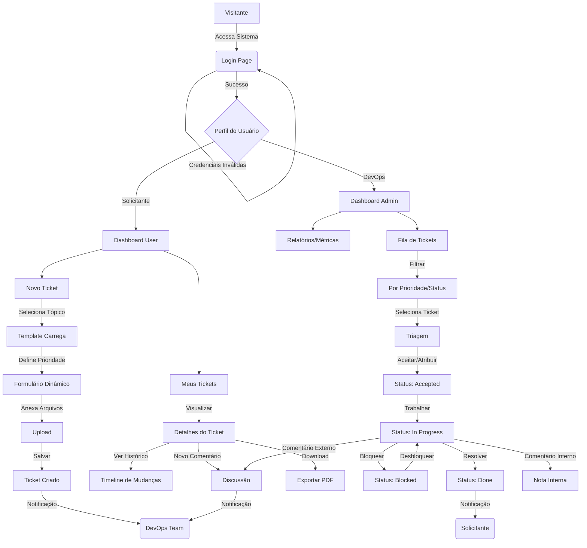
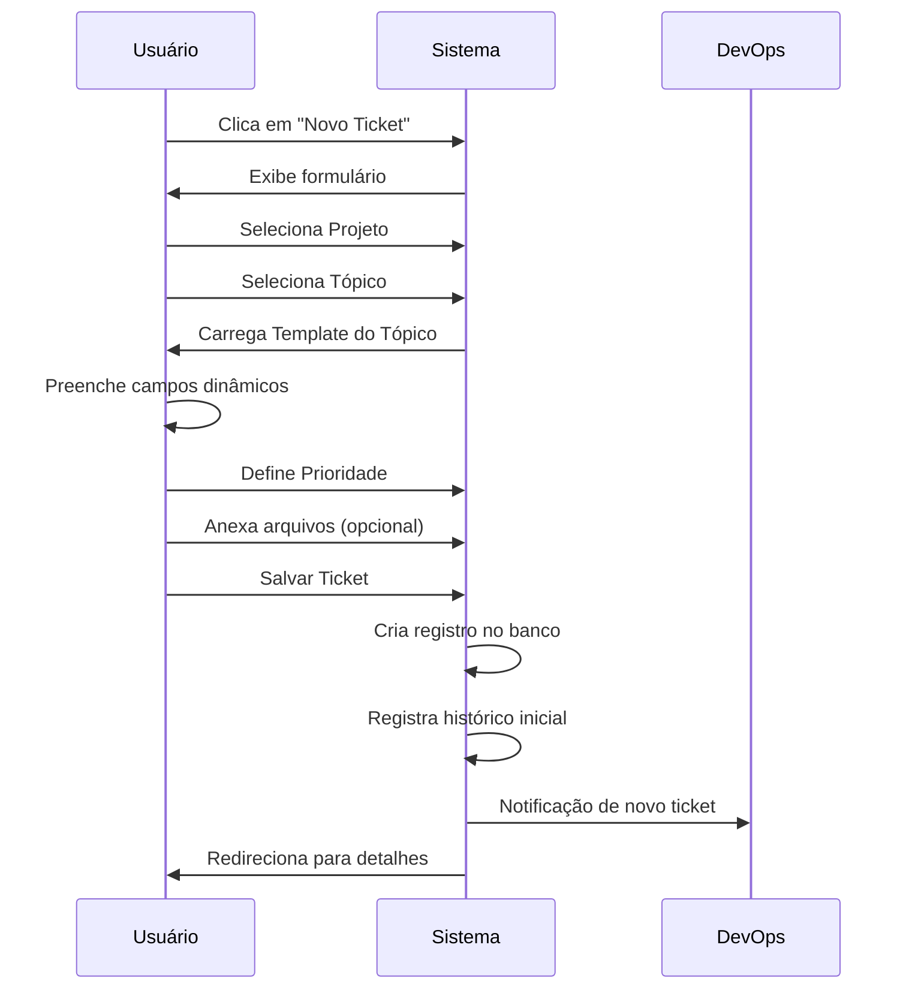
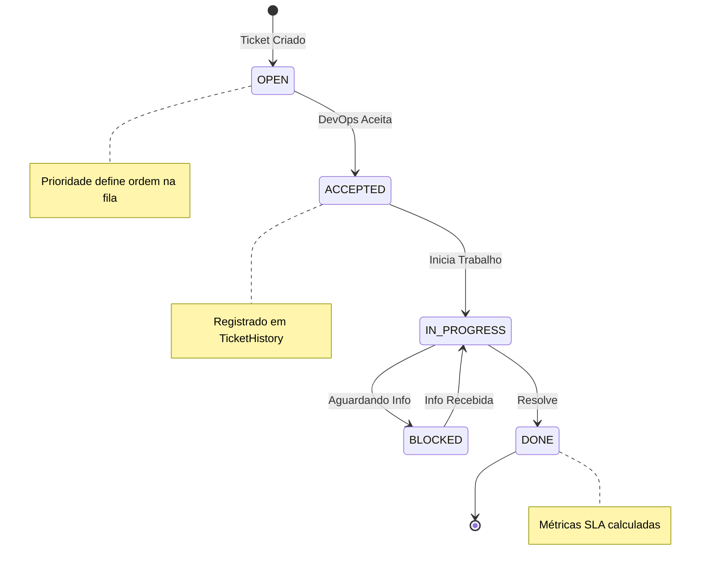
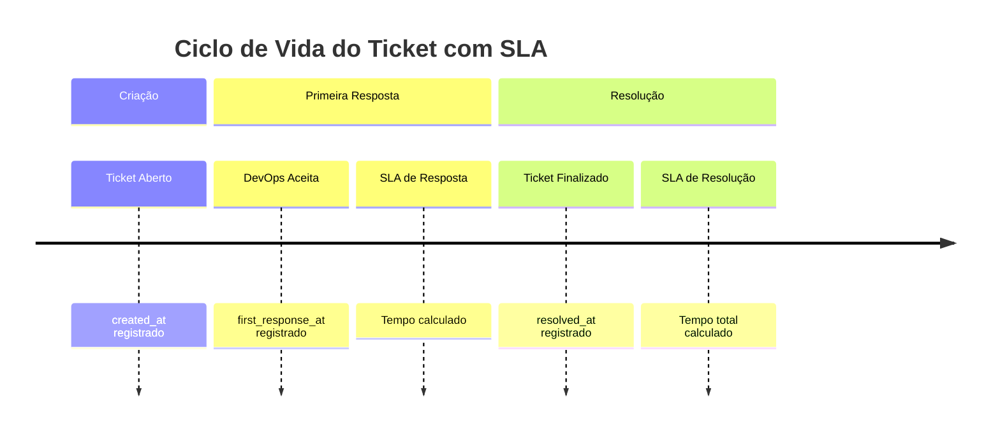

# Fluxos de Uso

Este documento ilustra os principais fluxos de navegação e interação dos usuários com o sistema ChamaDevOps.

## Fluxo Principal (Solicitante e DevOps)

O diagrama abaixo detalha a jornada desde o login até a resolução de um ticket, diferenciando as ações de usuários comuns (Solicitantes) e da equipe técnica (DevOps).

---

## Fluxo de Criação de Ticket

Detalhamento do processo de abertura de um novo ticket pelo solicitante.

---

## Fluxo de Triagem (DevOps)

Processo de aceitação e atribuição de tickets pela equipe DevOps.

---

## Fluxo de SLA e Métricas

O sistema registra automaticamente métricas para análise de performance.

---

## Legenda de Perfis

| Perfil | Permissões | Identificação |
|--------|------------|---------------|
| **Solicitante** | Ver próprios tickets, criar tickets, comentar | `is_staff = False` |
| **DevOps** | Ver todos os tickets, triagem, comentários internos, relatórios | `is_staff = True` |
| **Admin** | Todas as acima + gestão de projetos, tópicos e usuários | `is_superuser = True` |
