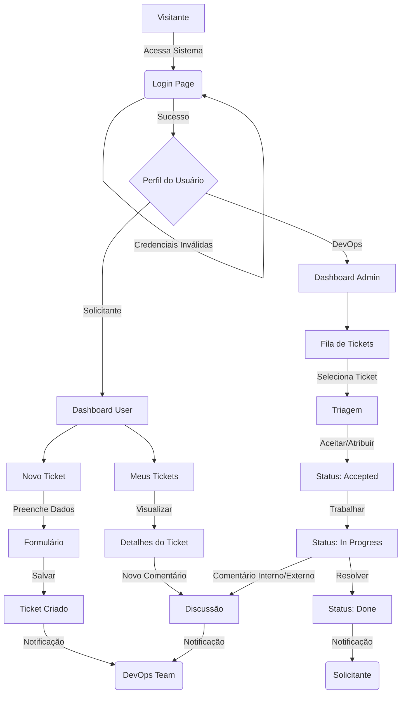

# Fluxos de Uso

Este documento ilustra os principais fluxos de navegação e interação dos usuários com o sistema ChamaDevOps.

## Fluxo Principal (Solicitante e DevOps)

O diagrama abaixo detalha a jornada desde o login até a resolução de um ticket, diferenciando as ações de usuários comuns (Solicitantes) e da equipe técnica (DevOps).

