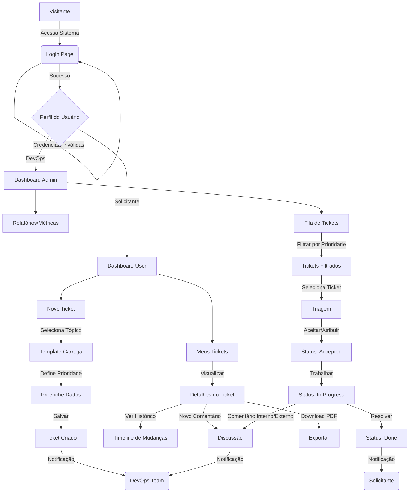
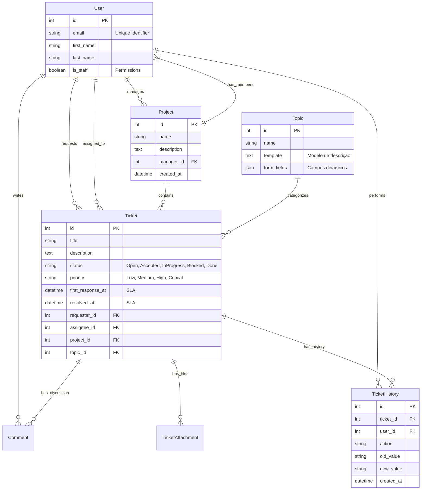

# Product Requirement Document (PRD) - ChamaDevOps

**Versão:** 3.0
**Data:** 06/01/2026
**Status:** Em Desenvolvimento Ativo

---

## 1. Visão Geral
O **ChamaDevOps** é uma plataforma centralizada para gerenciamento de solicitações de DevOps. O objetivo é eliminar a comunicação descentralizada (Slack, E-mail, Corredor) e garantir visibilidade, rastreabilidade e organização para as demandas de infraestrutura e suporte.

## 2. Tecnologias e Arquitetura

### Stack Tecnológica
*   **Backend:** Python 3.12+ com Django 6.0.
*   **Frontend:** Django Template System com **TailwindCSS**.
*   **Banco de Dados:** PostgreSQL (via Docker).
*   **Armazenamento:** MinIO (compatível S3) para arquivos.
*   **Proxy Reverso:** Nginx.
*   **Containerização:** Docker + Docker Compose.
*   **Arquitetura:** Monólito Modular (Apps desacoplados com prefixo `app_`).

### Estrutura de Módulos (Apps)
*   **`app_accounts`**: Gerenciamento de Identidade (Custom User Model).
*   **`app_management`**: Domínio administrativo (Projetos, Tópicos com Templates).
*   **`app_tickets`**: Domínio operacional (Tickets, Anexos, Comentários, Histórico).
*   **`app_reports`**: Dashboard e Métricas de produtividade.

---

## 3. Fluxos de UX (Mermaid)

### Fluxo Principal de Uso

---

## 4. Estrutura de Dados (Database Schema)

O diagrama abaixo reflete a estrutura atualizada do banco de dados.

---

## 5. Design System

O sistema utiliza uma identidade visual inspirada na AWS, priorizando profissionalismo e modernidade.

### Paleta de Cores
*   **Primary (Brand):** AWS Orange (`#F7931E`)
*   **Dark Mode:** Azul escuro AWS-inspired
*   **Backgrounds:** Modos claro e escuro com glassmorphism

### Status Badges
Padronização visual para status de tickets:
*   🟡 **Aberto (Open):** `bg-yellow-100 text-yellow-800`
*   🔵 **Aceito (Accepted):** `bg-blue-100 text-blue-800`
*   ⚙️ **Em Andamento (In Progress):** `bg-indigo-100 text-indigo-800`
*   🔴 **Travado (Blocked):** `bg-red-100 text-red-800`
*   🟢 **Finalizado (Done):** `bg-emerald-100 text-emerald-800`

### Priority Badges
*   🟢 **Baixa:** `bg-green-100 text-green-800`
*   🔵 **Média:** `bg-blue-100 text-blue-800`
*   🟠 **Alta:** `bg-orange-100 text-orange-800`
*   🔴 **Crítica:** `bg-red-100 text-red-800`

### Tipografia
*   **Fonte:** Inter (Google Fonts) ou System Stack.
*   **H1:** Texto 2xl/3xl, Bold, Slate-900.
*   **H2:** Texto lg/xl, Semibold, Slate-800.
*   **Body:** Texto sm/base, Regular, Slate-600.

---

## 6. Sprints e Roadmap

### ✅ Sprint 1: Fundação (Concluído)
*   Setup Django + Tailwind.
*   `app_accounts`: Login/Logout, Custom User Model.
*   Layout Base Responsivo.

### ✅ Sprint 2: Core & Gestão (Concluído)
*   `app_management` (antigo `app_core`): CRUD de Projetos.
*   `app_management` (antigo `app_core`): CRUD de Tópicos.
*   Remoção do conceito de "Times" para simplificação.

### ✅ Sprint 3: Operação de Tickets (Concluído)
*   `app_tickets`: Abertura de chamados.
*   `app_tickets`: Listagem e Detalhes.
*   `app_tickets`: Comentários Internos e Externos.
*   Anexos de Arquivos.

### ✅ Sprint 4: Refinamento & UX (Concluído)
*   **Renomeação de Apps**: Padronização `app_*` e `app_core` -> `app_management`.
*   **Melhorias em Projetos**: Campo de Descrição e Gerente Responsável.
*   **UI/UX**: Ícones nas listas (substituindo texto), Avatar com iniciais.
*   **E-mails**: Templates simplificados e limpos.

### ✅ Sprint 5: Containerização (Concluído)
*   **Docker**: Dockerfile e docker-compose.yml.
*   **MinIO**: Armazenamento de arquivos compatível S3.
*   **Nginx**: Proxy reverso para produção.
*   **Makefile**: Comandos padronizados (restart, populate, logs).

### ✅ Sprint 6: Features Avançadas (Concluído)
*   **Prioridade**: Campo de prioridade em tickets (Low, Medium, High, Critical).
*   **Histórico de Mudanças**: Modelo TicketHistory para auditoria.
*   **Métricas SLA**: Campos first_response_at e resolved_at.
*   **Templates de Tópicos**: Modelo de descrição e campos dinâmicos.
*   **Download PDF**: Exportação de detalhes do ticket.

### 🚧 Sprint 7: Melhorias Futuras (Backlog)
- [ ] **Notificações em Tempo Real**: WebSocket ou Polling para atualização de comentários.
- [ ] **API Rest**: Expor endpoints via DRF para integrações (Slack Bot).
- [ ] **Kanban Board**: Visualização de tickets em formato kanban.
- [ ] **Automações**: Regras automáticas baseadas em SLA e prioridade.

## 7. Métricas de Sucesso
*   Adoção de 100% da equipe técnica.
*   Redução de 80% nas interrupções via chat direto.
*   Tempo médio de primeira resposta < 4 horas.
*   Taxa de resolução dentro do SLA > 90%.
