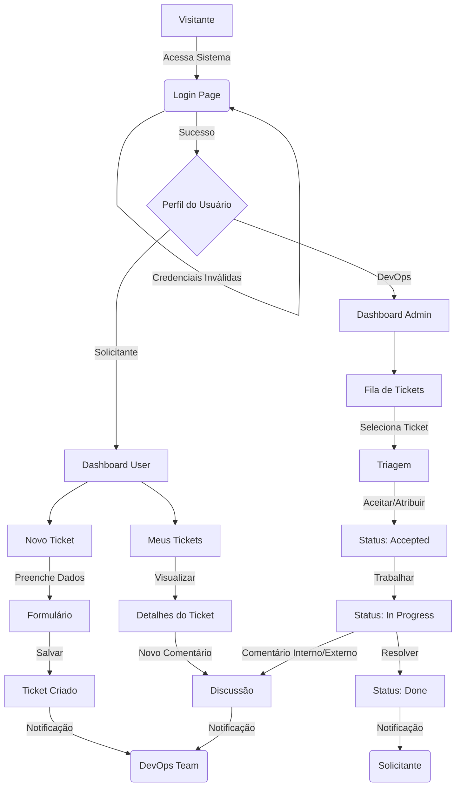
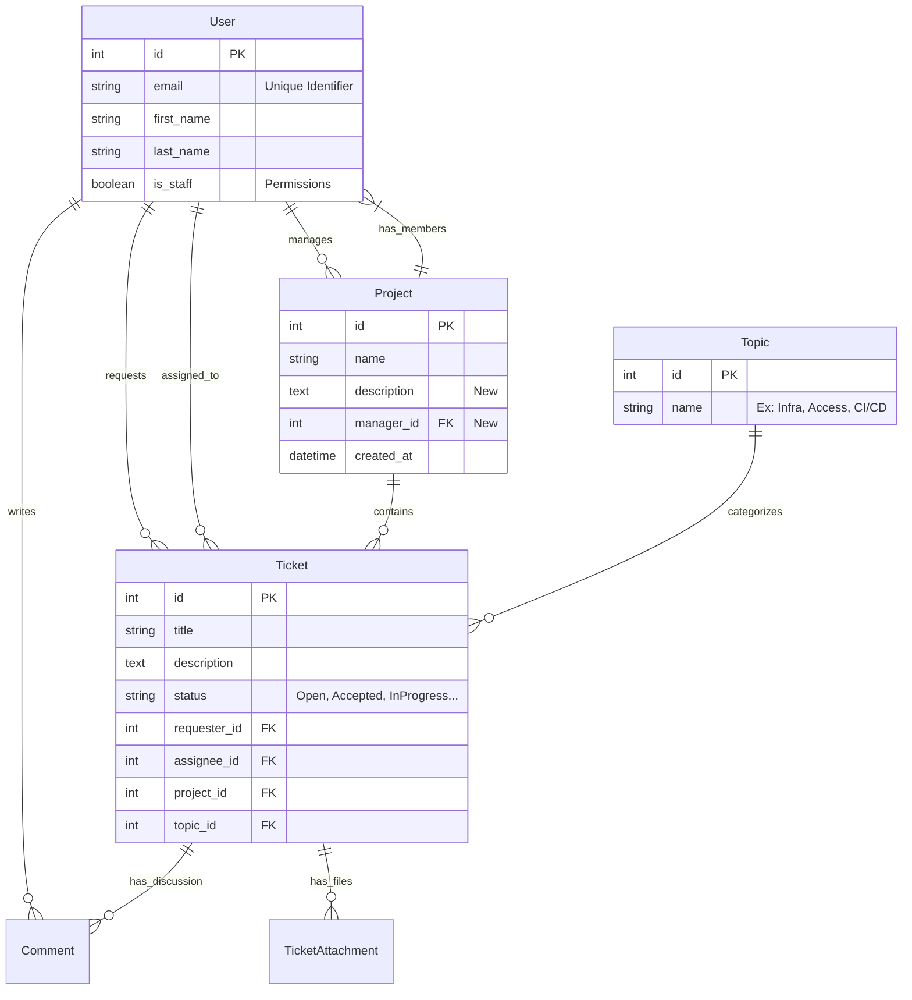

# Product Requirement Document (PRD) - ChamaDevOps

**Versão:** 2.1
**Data:** 26/12/2025
**Status:** Em Desenvolvimento Ativo

---

## 1. Visão Geral
O **ChamaDevOps** é uma plataforma centralizada para gerenciamento de solicitações de DevOps. O objetivo é eliminar a comunicação descentralizada (Slack, E-mail, Corredor) e garantir visibilidade, rastreabilidade e organização para as demandas de infraestrutura e suporte.

## 2. Tecnologias e Arquitetura

### Stack Tecnológica
*   **Backend:** Python 3.12+ com Django 6.0.
*   **Frontend:** Django Template System com **TailwindCSS** (via CDN/Static).
*   **Banco de Dados:** SQLite (Dev), PostgreSQL (Prod).
*   **Arquitetura:** Monólito Modular (Apps desacoplados com prefixo `app_`).

### Estrutura de Módulos (Apps)
*   **`app_accounts`**: Gerenciamento de Identidade (Custom User Model).
*   **`app_core`**: Domínio administrativo (Projetos, Tópicos, Dashboard).
*   **`app_tickets`**: Domínio operacional (Tickets, Anexos, Comentários).

---

## 3. Fluxos de UX (Mermaid)

### Fluxo Principal de Uso

---

## 4. Estrutura de Dados (Database Schema)

O diagrama abaixo reflete a estrutura atualizada do banco de dados, incluindo a remoção da entidade `Team` e a adição dos novos campos em `Project`.

---

## 5. Design System

O sistema utiliza uma identidade visual "Clean Professional", priorizando a legibilidade e a facilidade de uso.

### Paleta de Cores (Tailwind)
*   **Primary (Brand):** `indigo-600` (Botões, Links, Destaques)
*   **Secondary:** `purple-600` (Gradients, Detalhes)
*   **Backgrounds:** `slate-50` (App Background), `white` (Cards)
*   **Text:** `slate-900` (Títulos), `slate-600` (Corpo), `slate-400` (Legendas)

### Status Badges
Padronização visual para status de tickets:
*   🟡 **Aberto (Open):** `bg-yellow-100 text-yellow-800`
*   🔵 **Aceito (Accepted):** `bg-blue-100 text-blue-800`
*   ⚙️ **Em Andamento (In Progress):** `bg-indigo-100 text-indigo-800`
*   🔴 **Travado (Blocked):** `bg-red-100 text-red-800`
*   🟢 **Finalizado (Done):** `bg-emerald-100 text-emerald-800`

### Tipografia
*   **Fonte:** Inter (Google Fonts) ou System Stack.
*   **H1:** Texto 2xl/3xl, Bold, Slate-900.
*   **H2:** Texto lg/xl, Semibold, Slate-800.
*   **Body:** Texto sm/base, Regular, Slate-600.

---

## 6. Sprints e Roadmap

### ✅ Sprint 1: Fundação (Concluído)
*   Setup Django + Tailwind.
*   `app_accounts`: Login/Logout, Custom User Model.
*   Layout Base Responsivo.

### ✅ Sprint 2: Core & Gestão (Concluído)
*   `app_management` (antigo `app_core`): CRUD de Projetos.
*   `app_management` (antigo `app_core`): CRUD de Tópicos.
*   Remoção do conceito de "Times" para simplificação.

### ✅ Sprint 3: Operação de Tickets (Concluído)
*   `app_tickets`: Abertura de chamados.
*   `app_tickets`: Listagem e Detalhes.
*   `app_tickets`: Comentários Internos e Externos.
*   Anexos de Arquivos.

### ✅ Sprint 4: Refinamento & UX (Concluído)
*   **Renomeação de Apps**: Padronização `app_*` e `app_core` -> `app_management`.
*   **Melhorias em Projetos**: Campo de Descrição e Gerente Responsável.
*   **UI/UX**: Ícones nas listas (substituindo texto), Avatar com iniciais.
*   **E-mails**: Templates simplificados e limpos.

### 🚧 Sprint 5: Melhorias Futuras (Backlog)
- [ ] **Filtros Avançados**: Buscar tickets por texto, data ou responsável.
- [ ] **SLA**: Definição de tempo limite para atendimento baseado na prioridade.
- [ ] **Dashboard V2**: Gráficos reais (Chart.js ou ApexCharts) de produtividade.
- [ ] **Notificações em Tempo Real**: WebSocket ou Polling para atualização de comentários.
- [ ] **API Rest**: Expor endpoints via DRF para integrações (Slack Bot).

## 7. Métricas de Sucesso
*   Adoção de 100% da equipe técnica.
*   Redução de 80% nas interrupções via chat direto.
*   Tempo médio de primeira resposta < 4 horas.
